# TP 01

Realise par:

- Theo Arnal
- Dmitrii Kopenkin

<!-- TODO: EDIT -->

```
Si vous n'avez pas de logiciel pour voir les previews des fichiers markdown -> https://github.com/kopenkinda/YNOV_B3/tree/main/admin-bdd/cours-01#readme
```

## Exercice 1: Creation des tables

```md
Écrire puis exécuter le script SQL (que vous appellerez creParc.sql) de création des tables avec leur clé
primaire (en gras dans le schéma suivant) et les contraintes suivantes :

- Les noms des segments, des salles et des postes sont non nuls.
- Le domaine de valeurs de la colonne ad s’étend de 0 à 255.
- La colonne prix est supérieure ou égale à 0.
- La colonne dateIns est égale à la date du jour par défaut.
```

Fichier: `queries/creParc.sql` <br />
Résultat: <br />
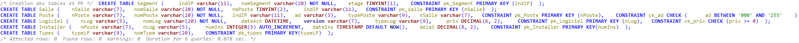<br />


## Exercice 2: Structure des tables

```md
Écrire puis exécuter le script SQL (que vous appellerez descParc.sql) qui affiche la description de toutes ces
tables (en utilisant des commandes DESCRIBE). Comparer le résultat obtenu avec le schéma ci-dessus.
Vous pouvez utiliser easyphp pour visualiser le schéma.
```

Fichier: `queries/descParc.sql` <br />
Résultat: <br />
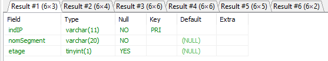<br />
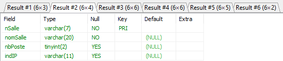<br />
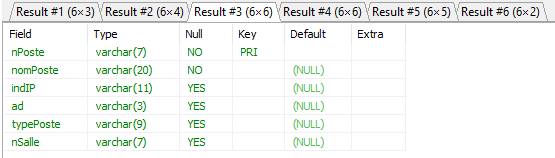<br />
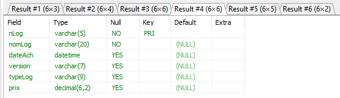<br />
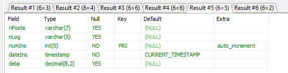<br />
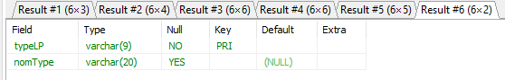

## Exercice 3: Destruction des tables

```md
Écrire puis exécuter le script SQL de destruction des tables (que vous appellerez dropParc.sql). Lancer ce script
puis celui de la création des tables à nouveau.
```

Fichier: `queries/dropParc.sql` <br />
Résultat: <br />
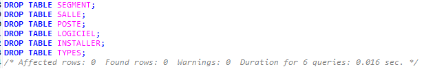

## Exercice 4: Interrogation des données

### Etape 1

```md
Écrire le script créaDynamique.sql permettant de créer les tables Softs et PCSeuls suivantes (en
utilisant la directive AS SELECT de la commande CREATE TABLE). Vous ne poserez aucune contrainte sur
ces tables. Penser à modifier le nom des colonnes.
```

Fichier: `queries/requetes-step1.sql` <br />
Résultat: <br />
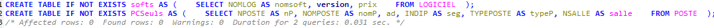<br />
<br />
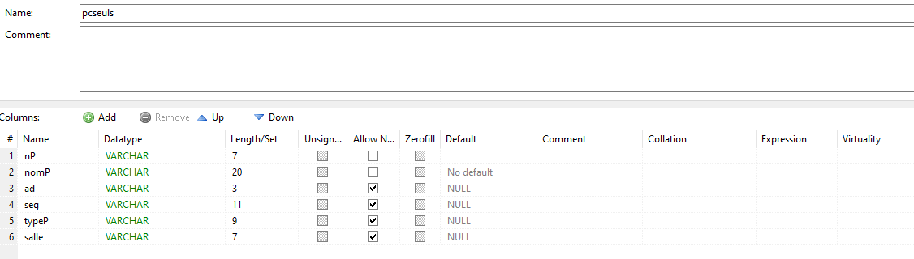<br />
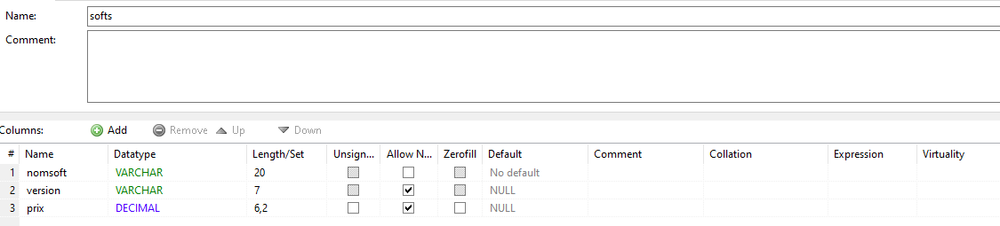

### Etape 2

```md
Écrire le script requêtes.sql permettant d’extraire, àl’aide d’instructions SELECT, les données
suivantes :

- Type du poste 'p8'.
- Noms des logiciels 'UNIX'.
- Noms, adresses IP, numéros de salle des postes de type 'UNIX' ou 'PCWS'.
- Même requête pour les postes du segment '130.120.80' triés par numéros de salles décroissants.
- Numéros des logiciels installés sur le poste 'p6'.
- Numéros des postes qui hébergent le logiciel 'log1'.
- Noms et adresses IP complètes (ex : '130.120.80.01') des postes de type 'TX' (utiliser la fonction de
  concaténation).
```

Fichier: `queries/requetes-step2.sql` <br />
Résultat: <br />
<br />
