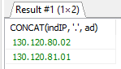

# TP 01

Realise par:

- Theo Arnal
- Dmitrii Kopenkin

<!-- TODO: EDIT -->

```
Si vous n'avez pas de logiciel pour voir les previews des fichiers markdown -> https://github.com/kopenkinda/YNOV_B3/tree/main/admin-bdd/cours-01#readme
```

## Exercice 1: Creation des tables

```md
Écrire puis exécuter le script SQL (que vous appellerez creParc.sql) de création des tables avec leur clé
primaire (en gras dans le schéma suivant) et les contraintes suivantes :

- Les noms des segments, des salles et des postes sont non nuls.
- Le domaine de valeurs de la colonne ad s’étend de 0 à 255.
- La colonne prix est supérieure ou égale à 0.
- La colonne dateIns est égale à la date du jour par défaut.
```

Fichier: `queries/creParc.sql` <br />
Résultat: <br />
<br />


## Exercice 2: Structure des tables

```md
Écrire puis exécuter le script SQL (que vous appellerez descParc.sql) qui affiche la description de toutes ces
tables (en utilisant des commandes DESCRIBE). Comparer le résultat obtenu avec le schéma ci-dessus.
Vous pouvez utiliser easyphp pour visualiser le schéma.
```

Fichier: `queries/descParc.sql` <br />
Résultat: <br />
<br />
<br />
<br />
<br />
<br />


## Exercice 3: Destruction des tables

```md
Écrire puis exécuter le script SQL de destruction des tables (que vous appellerez dropParc.sql). Lancer ce script
puis celui de la création des tables à nouveau.
```

Fichier: `queries/dropParc.sql` <br />
Résultat: <br />


## Exercice 4: Interrogation des données

### Étape 1

```md
Écrire le script créaDynamique.sql permettant de créer les tables Softs et PCSeuls suivantes (en
utilisant la directive AS SELECT de la commande CREATE TABLE). Vous ne poserez aucune contrainte sur
ces tables. Penser à modifier le nom des colonnes.
```

Fichier: `queries/requetes-step1.sql` <br />
Résultat: <br />
<br />
<br />
<br />


### Étape 2: Requêtes monotables

```md
Écrire le script requêtes.sql permettant d’extraire, àl’aide d’instructions SELECT, les données
suivantes :

- 1. Type du poste 'p8'.
- 2. Noms des logiciels 'UNIX'.
- 3. Noms, adresses IP, numéros de salle des postes de type 'UNIX' ou 'PCWS'.
- 4. Même requête pour les postes du segment '130.120.80' triés par numéros de salles décroissants.
- 5. Numéros des logiciels installés sur le poste 'p6'.
- 6. Numéros des postes qui hébergent le logiciel 'log1'.
- 7. Noms et adresses IP complètes (ex : '130.120.80.01') des postes de type 'TX' (utiliser la fonction de
     concaténation).
```

Fichier: `queries/requetes-step2.sql` <br />
Résultat: <br />
**1**
<br />
**2**
<br />
**3**
<br />
**4**
<br />
**5**
<br />
**6**
<br />
**7**


### Étape 3: Fonctions et groupements

```md
- 8. Pour chaque poste, le nombre de logiciels installés (en utilisant la table Installer).
- 9. Pour chaque salle, le nombre de postes (à partir de la table Poste).
- 10. Pour chaque logiciel, le nombre d’installations sur des postes différents.
- 11. Moyenne des prix des logiciels 'UNIX'.
- 12. Plus récente date d’achat d’un logiciel.
- 13. Numéros des postes hébergeant 2 logiciels.
- 14. Nombre de postes hébergeant 2 logiciels (utiliser la requête précédente en faisant un SELECT dans la
      clause FROM).
```

Fichier: `queries/requetes-step3.sql` <br />
Résultat: <br />
**8**
<br />
**9**
<br />
**10**
<br />
**11**
<br />
**12**
<br />
**13**
<br />
**14**


### Étape 4: Requêtes multitables

#### Operateurs ensemblistes

```md
- 15. Types de postes non recensés dans le parc informatique (utiliser la table Types).
- 16. Types existant à la fois comme types de postes et de logiciels.
- 17. Types de postes de travail n’étant pas des types de logiciels.
      Jointures procédurales
- 18. Adresses IP complètes des postes qui hébergent le logiciel 'log6'.
- 19. Adresses IP complètes des postes qui hébergent le logiciel de nom 'Oracle 8'.
- 20. Noms des segments possédant exactement trois postes de travail de type 'TX'.
- 21. Noms des salles où l’on peut trouver au moins un poste hébergeant le logiciel 'Oracle 6'.
- 22. Nom du logiciel acheté́le plus récent (utiliser la requête 12).
```

Fichier: `queries/requetes-step4_1.sql` <br />
Résultat: <br />
**15**
<br />
**16**
<br />
**17**
<br />
**18**
<br />
**19**
<br />
**20**
<br />
**21**
<br />
**22**


#### Jointures relationnelles

```md
Écrire les requêtes 18, 19, 20, 21 avec des jointures de la forme relationnelle. Numéroter ces nouvelles requêtes
de 23 à 26.

- 27. Installations (nom segment, nom salle, adresse IP complète, nom logiciel, date d’installation) triées par
      segment, salle et adresse IP
```

Fichier: `queries/requetes-step4_2.sql` <br />
Résultat: <br />
**23**
<br />
**24**
<br />
**25**
<br />
**26**
<br />
**27**


### Étape 5: Modifications synchronisées

```md
Écrire le script modifSynchronisées.sql pour ajouter les lignes suivantes dans la table Installer :
[DATA]
Écrire les requêtes UPDATE synchronisées de la forme suivante :
[DATA]
Pour mettre à jour automatiquement les colonnes rajoutées :

- nbSalle dans la table Segment (nombre de salles traversées par le segment) ;
- nbPoste dans la table Segment (nombre de postes du segment) ;
- nbInstall dans la table Logiciel (nombre d’installations du logiciel) ;
- nbLog dans la table Poste (nombre de logiciels installés par poste). Vérifier le contenu des tables
  modifiées (Segment, Logiciel et Poste).
```

Fichier: `queries/modifSynchronisees.sql` <br />
Résultat: <br />
