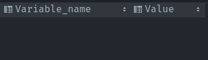

# TP 02

- Arnal Theo
- Dmitrii Kopenkin

## Partie I

### 3. Paramétrage dynamique du serveur

#### a. Changement pour la session

```sql
-- Changer la valeur par défaut.

SET SESSION sort_buffer_size = 262143;

-- Vérifierque la nouvelle valeur a bien été prise en charge
SHOW SESSION VARIABLES LIKE 'sort_buffer_size';
```


#### b.Changement global

```sql
-- Changer la valeur par défaut.
SET GLOBAL sort_buffer_size = 262142;

-- Vérifierque la nouvelle valeur a bien été prise en charge
SHOW GLOBAL VARIABLES LIKE 'sort_buffer_size';

-- Vérifier la valeur de la session, que constatez-vous?
SHOW SESSION VARIABLES LIKE 'sort_buffer_size';
```


<p>
Quand on modifie la variable global, on constate que la valeur de la session n'a pas pas changé car nous étions déjà connectez dessus, elle prendra effet lors de notre prochaine connexion
</p>

```sql
-- Redémarrez votre session.
-- Reverfier les valeurs session et global
SHOW GLOBAL VARIABLES LIKE 'sort_buffer_size';
SHOW SESSION VARIABLES LIKE 'sort_buffer_size';
-- Procédez à la modification de ces dernières, mais en les persistants cette fois-ci.
```

<p>La commande ne fonctionne pas car sur la version que nous utilisons, MySql ne prend pas en compte la commande PERSIST</p>

### 5. Visualisation de la configuration

#### a. Nombre de connexions simultanées

```sql
-- Modifiez le nombre de connexion par défaut (4 par exemple)
SET GLOBAL max_connections = 4;
-- Ouvrez 4 sessions mysql
-- Ouvre une cinquième session, quese passe-t-il?
```

 <br />

#### b. Caches de table

```sql
-- Modifier légèrementles valeurs de cache pour les tables
SET GLOBAL table_open_cache = 15;
```

#### c. Cache de threads

```sql
-- Changez la valeur par défaut
SET GLOBAL thread_cache_size = 1000;
-- Visualiser cette valeur
SHOW GLOBAL VARIABLES LIKE 'thread_cache_size';
-- La valeur affectée a-t-elle été enregistré dans le fichier de configuration?
```

 <br />
En changeant un peu la valeur par défaut cela ne s'enregistre pas dans le fichier de conf

### 7. Autres paramètres

```sql
-- Vérifiez la valeur par défaut: innodb_buffer_pool_instances
SHOW GLOBAL VARIABLES LIKE 'innodb_buffer_pool_instances';
-- Vérifiez les valeurs par défaut: innodb_buffer_pool_dump_at_shutdown,innodb_buffer_pool_load_at_startup
SELECT * FROM GLOBAL_VARIABLES WHERE VARIABLE_NAME LIKE 'innodb_buffer_pool%';
```

<br />
(Ma verison de mysql ne supporte pas cettee variable)
<br />

## Partie II

```sql
-- PAS d’utilisateur anonyme:
--    Révoquer tous les droits des utilisateurs anonymes (s’ilsexistent)
--    Détruire l’utilisateur anonyme ''@% (s’ilexiste)
DELETE FROM mysql.user WHERE user='' AND host='%';
FLUSH PRIVILEGES;
-- Utilisateur «interface de gestion de la base»:
--    Nom :admin_interface
--    C’est l’utilisateur backoffice en lien avec le gestionnaire de la base
--    Privilèges uniquement liés à la BD.
--    Consultation, modification, ajout, suppression pour toutes lestables
--    Exécution des procédures etfonctions
--    Visualisation desvues
--    Ne peut pas déléguer ses droits à un autre utilisateur (ce n’est pas un utilisateur humain)
CREATE USER 'admin_interface'@'%' IDENTIFIED  BY 'password';
GRANT ALTER, SELECT, DELETE, EXECUTE, INSERT, TRIGGER ON test.* TO 'admin_interface'@'%';
FLUSH PRIVILEGES;
-- Utilisateur « cust_interface»
--    C’est l’utilisateur frontoffice en lien avec leclient.
--    Privilèges uniquement liés à la BD
--    Droits debase
--    Droit de visualiser tout le contenu des tables: deux tables de votre choix. GRANT SELECT sur ces tables
CREATE USER 'cust_interface'@'%' IDENTIFIED  BY 'password_cust';
GRANT SELECT ON test.tab1 TO 'cust_interface'@'%';
GRANT SELECT ON test.tab2 TO 'cust_interface'@'%';
--    Droit d’insérer et de modifier des données de client dans la table de votre choix.GRANT INSERT et GRANT UPDATE sur cette table
GRANT INSERT, UPDATE ON test.tab1 TO 'cust_interface'@'%';
FLUSH PRIVILEGES;
```

#### QUESTION : Donner les requêtes permettant de tester les privilèges des deux utilisateurs (voir la liste desrequêtes ci-dessous) :

```sql
-- Une requête permettant de montrer que admin_interface a le privilège SELECT sur une des tables au niveau de laquelle vous avez mis des restrictions à la question precedente
-- Une requête permettant de montrer que admin_interface n’a pas le privilège CREATE TABLE dans la base
-- Une requête permettant de montrer que admin_interface n’a pas le privilège CREATE DATABASE
SHOW GRANTS FOR 'admin_interface'@'%'; -- Voir ( Img1 )

-- Une requête permettant de montrer que cust_interface a le privilège SELECT sur une des tables au niveau de laquelle vous avez mis des restrictions à la question précédente
-- Une requête permettant de montrer que cust_interface n’a pas le privilège SELECT sur une des tables au niveau de laquelle vous avez mis des restrictions à la question précédente
-- Une requête permettant de montrer que cust_interface a le privilège INSERT sur latable sur une des tables au niveau de laquelle vous avez mis des restrictions à la question précédente
-- Une requête permettant de montrer que cust_interface n’a pas le privilège CREATE TABLE dans labase
-- Une requête permettant de montrer que cust_interface n’a pas le privilège CREATEDATABASE
SHOW GRANTS FOR 'cust_interface'@'%'; -- Voir ( Img2 )
```

**Img1**
 <br />

**Img2**
 <br />
